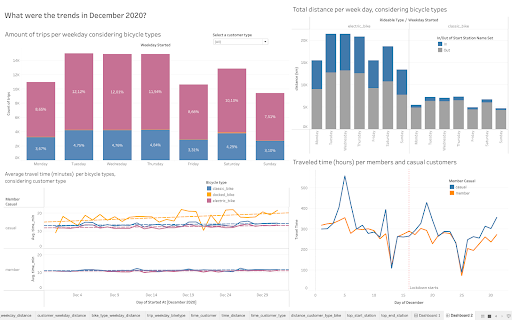

# Final Project
*Karina Condeixa* 
*Data Analytics - group March 2021*

## Rental bikes - Bay Wheels

## Content
- Project Description
- Dataset
- Tools
- Cleaning, wrangling and exploratory analysis
- Data visualization & slides
- Conclusion
- Limitations
- Lessons learned
- Future analysis
- Project Management

## Project Description

#### What?
The assess rental bikes for Lyft in Bay Wheels, San Francisco, California.

#### When? 
Data of December 2020.  

#### Why?
To check of how and if the lockdown affected the trip. The Lockdown in San Francisco started on 16th December.

## Dataset
[dataset](https://www.lyft.com/bikes/bay-wheels/system-data)

"Baywheels-data"  
150.102 records of trips  
- Start Time and Date
- End Time and Date
- Start Station ID
- Start Station Name
- Start Station Latitude
- Start Station Longitude
- End Station ID
- End Station Name
- End Station Latitude
- End Station Longitude
- Bike ID
- User Type (Member or Casual)

## Tools

## Cleaning, wrangling and exploratory analysis
I calculated time of trips and Distance traveled. And explored bicycle types, customer types, weekdays, distances and durations. 
[part1](final_project_lyft1.ipynb) 
[part2](final_project_lyft1.ipynb) 
[part3](final_project_lyft1.ipynb) 

## Data visualization & slides
[presentation](https://docs.google.com/presentation/d/1Ypx_lE4-HeZmYsi63FDsij1Qmwt9pQtAmZAOPA9KUqw/edit?usp=sharing)

## Conclusions
- Most trips is short, using less than 30 minutes ($3).
- Most of the trips are made by casual customers (not members).
- Electric bicycles seem to be in greater demand. 
- They seem to be used for transport to public transportation.
- Tuesday, Wednesday and Thursday are the days with the most trips.
- In December there was a small decline in travel, only docked bicycles had an increase in travel. 
Note: These analyzes need to be deepened with greater temporal and regional analysis to be accurate. 

## Limitations 
- Too heavy dataset.
- Difficulty to create an environment to work with coordinates to make graphs.
- Short time to develop.

## Lessons learned
- Prepare the Python environment in advance (maily using maps).
- Scale (reduce) the dataset before doing data visualization.
- Avoid to use Google Colab when using an extern and dataset.
- Do not add (large) datasets on GitHub

## Future analysis
- Trends to next and previous months
- Trips in December of 2019 and 2018
- Regional characteristics

## Project Management
[Trello](https://trello.com/b/vgwLMpk3/final-project-ironhack)

